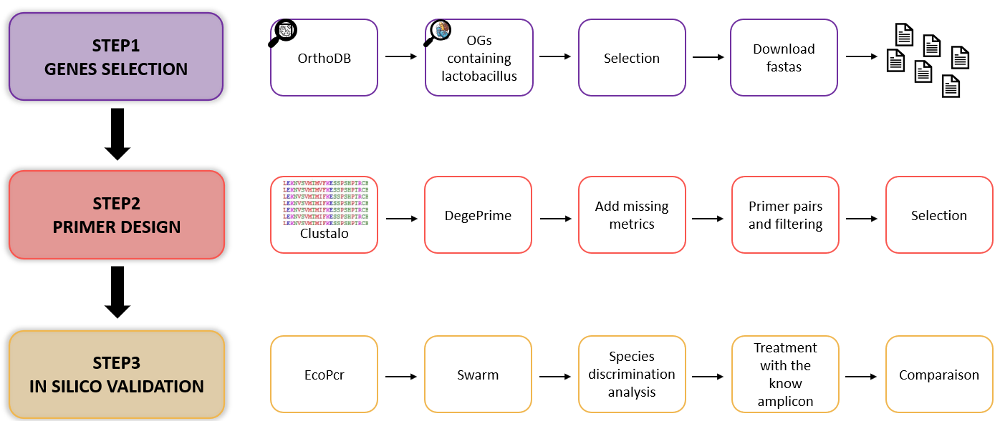

# TAD ( Taxon mArker Design)

## Presentation

TAD is a tool developed in Python and Bash, designed to identify genetic markers specific to a given taxonomic rank. In metabarcoding sequencing analysis, the 16S rRNA gene is commonly used, although it has limitations, notably its presence in multiple copies and its low resolution at the level of closely related organisms. The aim of TAD is to select target genes that are potentially more effective than 16S at discriminating between species. As an input, simply provide the desired taxonomic identifier (for example, family ‘Actinomycetes’, taxid: 1760).




**TAD is divided into 3 pipelines:**

* STEP 1: Gene selection 
In this step, we will select, from the OrthoDB database, orthologous gene groups which include a sufficient number of species corresponding to the defined taxonomic rank. We will obtain a fasta for each orthologous group. We also get a summary sheet of all the information we have on the gene. 

  See the [STEP1_GENES_SELECTION](./tools/STEP1_GENES_SELECTION) folder for more details and all the steps.

* STEP 2: Primer design 
During this stage, we align the FASTA sequences to generate pairs of primers. We then select them according to various criteria, such as melting temperature, presence of a GC clamp, etc. We obtain the best possible pairs with a graphical output of their characteristics.

   See the [STEP2_PRIMER_DESIGN](./tools/STEP2_PRIMER_DESIGN) folder for more details and all the stages.

* STEP 3: In silico validation of primers and amplicons.
We carry out an in silico PCR to validate our primers, then carry out a discriminatory analysis at species level to check whether the targeted amplicon is sufficiently discriminatory. Finally, for the species detected by the in silico PCR, we recover their known amplicon sequences (e.g. 16S) and apply the same discriminatory treatment to determine whether our new pair of primers performs better.

  See the [STEP3_IN_SILICO_VALIDATION](./tools/STEP3_IN_SILICO_VALIDATION) folder for more details and all the steps involved.

## Installing TaxonMarker

```
git clone https://github.com/GTG1988A/TAD.git
cd TaxonMarker
```

## Preparing the environment

### Creation of different environments conda

```bash=
conda env create --name TaxonMarker_main --file environment_main.yml
conda activate TaxonMarker_main
```

For the in silico PCR steps and the use of tools from the Obitools suite, a version of python 2.7 must be used. A second dedicated environment must therefore be used: 

```bash=
conda env create --name TaxonMarker_ecopcr --file environment_ecopcr.yml
conda activate TaxonMarker_ecopcr
```


### Download the OrthoDB database 

```bash=
wget -r -np  --cut-dirs=2  https://data.orthodb.org/v12/download/
```

## Launching step 1
Throughout these steps, examples of commands are illustrated using a test data set available in the ``data_test.`` folder
=> go to the [STEP1_GENES_SELECTION](./tools/STEP1_GENES_SELECTION)  folder

```
cd STEP1_GENES_SELECTION
```

# Descriptions of the databases available for TaxonMarker: 

**OrthoDB is the only database required to generate your primers.

However, for in silico PCR tests and comparison with 16S, the use of different databases will be necessary.

The processing steps for converting them to a format compatible with TaxonMarker, as well as the associated scripts, can be found in the tools/bonus_script_format_ecopcrDB folder.

## OrthoDB

https://www.orthodb.org/

Database maintained by the University of Geneva and the SIB (Swiss Institute of Bioinformatics).

It contains groups of orthologous genes from the entire living kingdom
 = All the descendants of a particular single gene from the last common ancestor of these species.

## EcoPCR DataBase
We are formatting a database containing **all** NCBI microbial genomes (fasta and gff) contained in the RefSeq and GenBank databases with the GTDB taxonomy using the genome_updater tool (https://github.com/pirovc/genome_updater).

Important file: name_seq_with_taxo.txt. 
This allows me to have the species content in all my genomes and to keep this information for future comparisons. You will need it to run certain scripts.

It is stored at the Genotoul cluster in Toulouse.
Size: 781 GB

## 16S Database 

We have extracted the 16S rRNA sequences from a database containing the NCBI microbial genomes (fasta and gff) contained in the RefSeq and GenBank databases using the GTDB taxonomy with the genome_updater tool. 

*NOTE: This is exactly the same download as for the complete EcoPCR database.


It is not in the format accepted by EcoPCR. You must format your selection of sequences. Everything is indicated in 

```tools/STEP3_IN_SILICO_VALIDATION/2_Amplicon_comparison/```

Important file: 16S_with_taxonomy.tsv 
This allows me to have the content of the species in all my genomes and to keep this information for future comparisons. You will need it to run certain scripts.

It is stored at the Genotoul cluster in Toulouse.
Size: 1.5 GB 

## ncbi tax_dump

This allows us to have the ncbi taxonomy.
All the info can be found here:
https://ftp.ncbi.nlm.nih.gov/pub/taxonomy/new_taxdump/

Download it like this:
```bash=
wget -r https://ftp.ncbi.nlm.nih.gov/pub/taxonomy/new_taxdump/
```

Size: 1.9 GB
