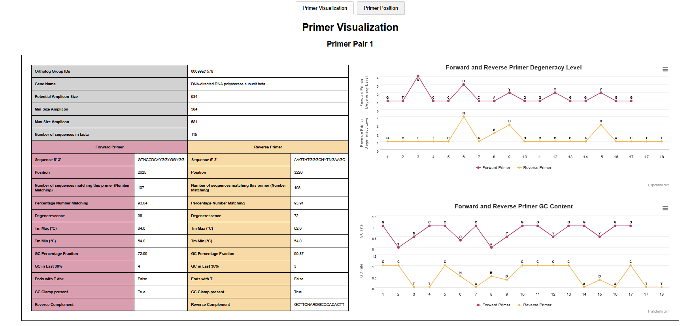
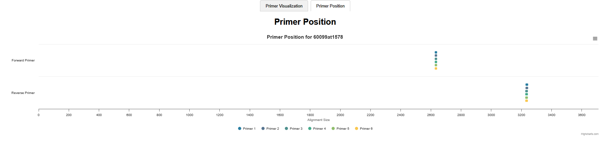

# STEP2_PRIMER_DESIGN
## Degeprime installation
You need to install this tool.

```bash
git clone https://github.com/EnvGen/DEGEPRIME.git
```

## Launch 1_primer_pipeline.sh
For users of a calculation cluster, this script runs all the steps at once. To do this, you need to issue a command like this:
```bash!
sbatch -J primer_pipeline  -o %x.out -e %x.err -p workq --mem=80G -c 4 --wrap="sh 1_primer_pipeline.sh --fasta_path ../STEP1_GENES_SELECTION/2_fasta_recovery/ --degeneracies_values 72 96 --min_primer_length 14 --max_primer_length 24 --tab_og_updated ../STEP1_GENES_SELECTION/2_fasta_recovery/test_output_updated_test_OG_1578_selected.tab --number_matching_max 80 --tm_max 65 --tm_min 54 --amplicon_min_size 150 --amplicon_max_size 590"
```

parameter descriptions:
```bash
Options:
  --fasta_path <path>            Path to the directory containing the .fa files (mandatory, no default value).
  --value_degeneracies <int>     List of degeneracy values (e.g., 48 96). Mandatory.
  --min_primer_length <int>      Minimum primer length. Default: 14.
  --max_primer_length <int>      Maximum primer length. Default: 24.
  --tab_og_updated <path>        File for the -og parameter in process_primers_stat.py. This is the updated OG file after downloading the FASTA files. (default is empty, so it is mandatory if Step 6 is used).
  --number_matching_max <int>    Parameter -nm (default: 80).is the number of sequences that match this primer divided by the total number of sequences * 100. This is the minimum we expect.
  --tm_max <int>                 Parameter -tm_max (default: 65).
  --tm_min <int>                 Parameter -tm_min (default: 54).
  --amplicon_min_size <int>      Minimum amplicon size (default: 150).
  --amplicon_max_size <int>      Maximum amplicon size (default: 590).
  -h, --help                     Display this message and exit.
```

The output is a sorted_results.tsv file containing the primer pairs with the three highest scores.

To understand each step, or if you're not on a cluster, please read on.

### 1. Description of the steps and launch without 1_primer_pipeline.sh
### a. Start sequence alignment of all OGs with Clustal Omega

Example:
```bash!
mkdir -p alignment/

for files in ../STEP1_GENES_SELECTION/2_fasta_recovery/*.fa; do
     file_name=$(basename "$files")
     clustalo -i "$files" -o "alignment/$file_name" --threads=4
done
```

### b. Launching Degeprime trim 
NB: See + about trim in the degeprime github.
Example:

```bash!
for files in alignment/*.fa; do
    file_name=$(basename "$files" .fa)
    perl DEGEPRIME/TrimAlignment.pl -i "$files" -min 0.9 -o "alignment/trimmed_$file_name.fna"
done
```
### c. Generation of all possible primers

All possible primers are generated by specifying the minimum and maximum primer length parameters and the degeneracy values.

Example:
```bash!
fasta_files='alignment/*.fa'  
result_dir='degeprime_result/'
aln_dir='alignment/'

degeneracies='72 96' #a ajuster ici 
lengths='17 18 19 20' #a ajuster ici 

mkdir -p "$result_dir"

for fasta_file in $fasta_files
do
  cog=$(basename "$fasta_file" .fa)
  trimmed_alignment="$aln_dir/trimmed_${cog}.fna"

  for d in $degeneracies
  do
    for l in $lengths
    do
      output_fl=$result_dir/${cog}_d${d}_l${l}.tsv

      echo "Launch : perl DEGEPRIME/DegePrime.pl -i $trimmed_alignment -d $d -l $l -o $output_fl"
      perl DEGEPRIME/DegePrime.pl -i "$trimmed_alignment" -d "$d" -l "$l" -o "$output_fl" > degeprime.log
    done
  done
done
```
NB: Degeneracy is the total number of possible combinations of nucleotides that a degenerate primer can form. For example, for the ATCS primer, where S represents G or C, the possible combinations are ATCG and ATCC. The degeneracy is therefore equal to 2. Possible degeneracy values could be 1, 2, 3, 4, 6, 8, 9, 12, 16, 18, 24, 27, 32, 36, 48, 54, 64, 72, 81, 96, 108 and so on. 


```
-d should be a possible degeneracy, i.e. 1, 2, 3, 4, 6, 8, 9, 12, and so forth (or more generally, a number > 0 that can be expressed as 2^i * 3^j, where i and j are integers or 0).
```
### d. Concatenation of results

We concatenate the results to obtain one file per OGs

```bash!
# Define the path of the directory containing the files
directory="degeprime_result"

# Recover file prefixes
prefixes=$(ls -1 "$directory" | grep -E ".*\.tsv$" | cut -d'_' -f1 | sort | uniq)

# Loop on each prefix
for prefix in $prefixes; do
    # Concatenate all files with the same prefix
    files=$(ls -1 "$directory"/"$prefix"* 2>/dev/null | grep -E ".*\.tsv$")
    if [ ! -z "$files" ]; then
        concatenated_file="$directory/concatenated_$prefix.tsv"
        cat $(echo "$files" | head -n1) > "$concatenated_file"
        for file in $(echo "$files" | tail -n+2); do
            tail -n +2 "$file" >> "$concatenated_file"
        done
    fi
done
```

### e. Adding metrics to primers

We run a program to add metrics to the primers.

The statistics added are: minimum and maximum temperature, percentage of GC, presence of a GC clamp, percentage of number matching, whether the primer ends in a T, whether it is complementary to itself.

We will specify the desired maximum and minimum temperatures, as well as the minimum matching percentage (= number of sequences where a primer is found identically). Primers that do not meet these criteria will be deleted.

We will obtain a TSV file containing the primers matching our criteria, with the new statistics added to the table.

```bash!
mkdir result_stat_primers
python process_primers_stat.py -i degeprime_result/concatenated_* -og ../STEP1_GENES_SELECTION/2_fasta_recovery/updated_test_output_OG_1578_selected_home.tab -o result_stat_primers -nm 80 -tm_max 65 -tm_min 54
```
### f. Creation of the table of pairs of primers.

We run a program to generate all possible pairs of primers. We specify the minimum and maximum amplicon size between the two primers. Pairs that do not meet these criteria will be deleted. In addition, pairs with a temperature difference of more than 5 degrees between the primer forward and the primer reverse will also be eliminated.

Example:
```bash!
for file in result_stat_primers/concatenated_*; do
    echo "Treatment of : $file"
    python couple_primer.py -i "$file" -f alignment/ --amplicon_min_size 150 --amplicon_max_size 590
done
```

Each pair of primers was given a total score, calculated by adding the scores for number matching and amplicon size. We judged these parameters to be the most important after carrying out the selection based on temperature and amplicon size.

### g. Concatenation of results and selection of the best pairs.

We concatenate the results with 0_script_step_by_step/concatenate_sort_result.sh and obtain the file sorted_results.tsv containing the pairs with the three best scores. 

We can then try to choose those with the lowest degeneracy, a GC percentage of 50% or a GC clamp at the end, etc.

## 2. Vizualisation 

A script called primer_metrics_visualization.py takes the sorted_results.tsv file as input and generates :

- Per pair of primers :
    - A summary sheet of the pair of primers with all its metrics.
    - A graph showing the distribution of degeneracy. It is preferable for degeneracy to be more concentrated at the beginning of the primer than at the end. This histogram gives a better idea of the distribution.
    - A graph showing GC concentration at different positions.

- By OG :
    - A graph showing the position of the primers on the gene alignment.

As part of the analysis with the FROGS tool, we also need the theoretical minimum and maximum amplicon sizes. To do this, we run in silico PCR steps to retrieve this information. This step can be performed before running primer_metrics_visualization.py.

All the steps, if you are on a calculation cluster, are automated via the following scripts:

    1_Obiconvert_fasta_OG.sh
    2_launch_ecopcr_and_add_amplicon_length_info.sh, qui exécute ecopcr_and_add_amplicon_length_info.py
    3_launch_primer_metrics_visualization.sh, qui exécute primer_metrics_visualization.py
    
All you have to do is adapt the .sh files to suit your needs.

**If not, here are the different steps:**

## a. Obiconvert
***The conda TaxonMarker_ecopcr environment must be activated***.

This script formats FASTA files in a format compatible with ecoPCR.

You will need the taxdump bank. To find out more, consult the home README, in the ‘Description of databases available for TaxonMarker’ section.

```bash!
Usage: ./1_Obiconvert_fasta_OG.sh /path/to/ncbi_tax_dump fasta_file1 [fasta_file2 ...] or all fasta *.fa.
  the best use is to select the OG fastas in the results table.
  Formatting is a fairly long process, so select the ones you have rather than formatting them all.
```

Example:
```
./1_Obiconvert_fasta_OG.sh $PATH_NCBI_TAX_DUMP/ ../../STEP1_GENES_SELECTION/2_fasta_recovery/60099at1578_fasta.fa
```

# b.ecoPCR 
We run the script ecopcr_and_add_amplicon_length_info.py, which takes as input the file sorted_results.tsv containing all the best pairs of primers.

It performs an ecoPCR for each pair, determines the minimum and maximum amplicon sizes and then updates sorted_results.tsv with this information.

Example:

```
python 2_launch_ecopcr_and_add_amplicon_length_info.py ../sorted_results.tsv ecoPCR_db_*
```

# c. Starting the visualisation
**conda environement TaxonMarker_main**

/!\ The conda TaxonMarker_main environment must be activated. Otherwise you will get errors because this is not the correct version of python.

Example:
```
python 3_primer_metrics_visualization.py -i ../sorted_results_updated.tsv -o primer_metrics_visualization.html
```
Vision of html result:




You now need to select the primer pairs you think are most appropriate. You have finished and obtained your primers.


If you want to test them, go to the home page to read the information in the section ‘Description of the databases available for TaxonMarker’ [here](../../README.md) , then go on to [STEP3_IN_SILICO_VALIDATION](../STEP3_IN_SILICO_VALIDATION)
